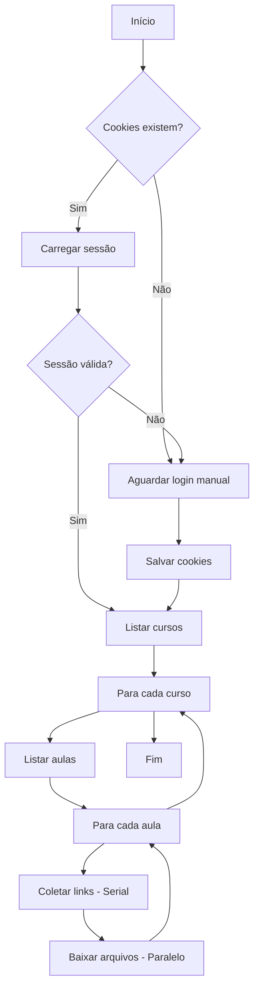

# 📚 AutoDownload Estratégia Concursos

> Downloader automático de cursos do Estratégia Concursos, otimizado para macOS.

[](https://www.python.org/downloads/)
[](https://opensource.org/licenses/MIT)

## ✨ O que você vai conseguir

- **Baixar automaticamente** todos os seus cursos, aulas, PDFs e vídeos
- **Manter sessão salva** para não precisar logar toda vez
- **Downloads paralelos** para maior velocidade
- **Modo headless** para rodar em segundo plano

---

## 🚀 Início Rápido

### 1. Clone o repositório

```bash
git clone https://github.com/seu-usuario/EstrategiaDownloader.git
cd EstrategiaDownloader
```

### 2. Crie um ambiente virtual e instale as dependências

```bash
python3 -m venv .venv
source .venv/bin/activate
pip install -r requirements.txt
```

### 3. Execute o script

```bash
python main.py
```

Na primeira execução, o navegador abrirá para você fazer login. Após o login, os cookies serão
salvos automaticamente.

---

## ⚙️ Opções de Linha de Comando

| Argumento           | Descrição                                       | Padrão                                       |
| ------------------- | ----------------------------------------------- | -------------------------------------------- |
| `-d`, `--dir`       | Diretório para salvar os arquivos               | `~/Library/Mobile Documents/.../Meus Cursos` |
| `-w`, `--wait-time` | Tempo (segundos) para aguardar o login manual   | `60`                                         |
| `--headless`        | Executa o navegador em modo oculto (sem janela) | Desabilitado                                 |
| `--workers`         | Número de downloads simultâneos                 | `4`                                          |

### Exemplos de Uso

**Rodar em segundo plano (mais rápido):**

```bash
python main.py --headless
```

**Aumentar velocidade de download:**

```bash
python main.py --workers 8
```

**Salvar em um diretório personalizado:**

```bash
python main.py -d ~/Downloads/Cursos
```

**Combinar opções:**

```bash
python main.py --headless --workers 8 -d ~/Downloads/Cursos
```

---

## 📁 Estrutura de Arquivos Baixados

```
Meus Cursos - Estratégia Concursos/
├── Nome_do_Curso/
│   ├── Aula_01_Introducao/
│   │   ├── Assuntos.txt
│   │   ├── Aula_01_PDF_Original.pdf
│   │   ├── Aula_01_PDF_Simplificado.pdf
│   │   ├── Video_Titulo_720p.mp4
│   │   └── Video_Titulo_Resumo_0.pdf
│   └── Aula_02_Conceitos/
│       └── ...
└── Outro_Curso/
    └── ...
```

---

## 🔧 Resolução de Problemas

### O navegador não abre

**Certifique-se de que o Chrome ou Edge está instalado:**

```bash
# Verificar Chrome
/Applications/Google\ Chrome.app/Contents/MacOS/Google\ Chrome --version
```

### Erro de certificado SSL

Este script já desabilita a verificação SSL automaticamente. Se ainda assim tiver problemas, tente:

```bash
pip install --upgrade certifi
```

### Cookies não funcionam / Sessão expira

Delete o arquivo `cookies.json` e faça login novamente:

```bash
rm cookies.json
python main.py
```

### Download muito lento

Aumente o número de workers:

```bash
python main.py --workers 8
```

> ⚠️ **Atenção:** Muitos workers podem sobrecarregar sua conexão ou ser bloqueados pelo servidor.

---

## 📋 Requisitos

- **Python** 3.9 ou superior
- **Google Chrome** ou **Microsoft Edge**
- **Conta ativa** no Estratégia Concursos

### Dependências Python

- `requests` - Requisições HTTP
- `tqdm` - Barras de progresso
- `colorama` - Cores no terminal
- `selenium` - Automação do navegador

---

## 🏗️ Arquitetura



---

## 🤝 Contribuindo

1. Faça um fork do projeto
2. Crie uma branch para sua feature (`git checkout -b feature/nova-feature`)
3. Commit suas mudanças (`git commit -m 'Adiciona nova feature'`)
4. Push para a branch (`git push origin feature/nova-feature`)
5. Abra um Pull Request

---

## ⚠️ Aviso Legal

Este projeto é apenas para **uso pessoal e educacional**. Respeite os termos de uso do Estratégia
Concursos. O desenvolvedor não se responsabiliza pelo uso indevido desta ferramenta.

---

## 📄 Licença

Este projeto está sob a licença MIT. Veja o arquivo [LICENSE](LICENSE) para mais detalhes.
