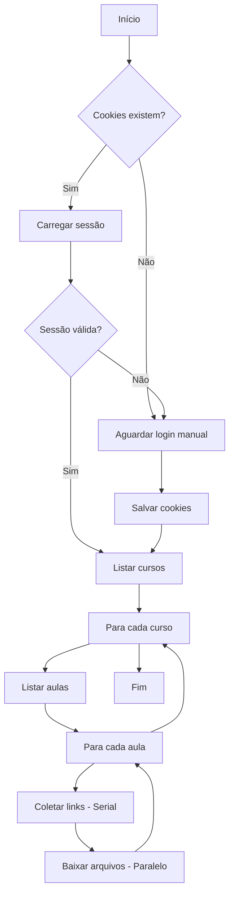

# 📚 AutoDownload Estratégia Concursos

> Downloader automático de cursos do Estratégia Concursos, otimizado para macOS.

[](https://www.python.org/downloads/)
[](https://opensource.org/licenses/MIT)

## ✨ Recursos Principais

- ⚡ **Downloads assíncronos ultra-rápidos** (modo padrão)
- 🔄 **Retry automático** com backoff exponencial (4 tentativas)
- 💾 **Resume de downloads** interrompidos (arquivos .part)
- ✅ **Checkpoint/index** para não re-baixar arquivos completos
- 🔐 **Login persistente** via cookies salvos
- 📦 **Downloads paralelos** configuráveis (padrão: 4 workers)
- 👻 **Modo headless** para rodar em segundo plano
- 🎨 **Interface CLI moderna e elegante** com ASCII art e cores
- 📊 **Progress bars** detalhadas com ícones Unicode

## 🎨 Interface Moderna

O downloader agora possui uma interface CLI elegante e profissional:

```
╭──────────────────────────────────────────────────────────────────╮
│                                                                  │
│     ███████╗███████╗████████╗██████╗  █████╗ ████████╗          │
│     ██╔════╝██╔════╝╚══██╔══╝██╔══██╗██╔══██╗╚══██╔══╝          │
│     █████╗  ███████╗   ██║   ██████╔╝███████║   ██║             │
│     ██╔══╝  ╚════██║   ██║   ██╔══██╗██╔══██║   ██║             │
│     ███████╗███████║   ██║   ██║  ██║██║  ██║   ██║             │
│     ╚══════╝╚══════╝   ╚═╝   ╚═╝  ╚═╝╚═╝  ╚═╝   ╚═╝             │
│                                                                  │
│              D O W N L O A D E R   v 2.0                         │
│                                                                  │
╰──────────────────────────────────────────────────────────────────╯
```

**Features visuais:**

- 📚 Headers com bordas arredondadas para cursos e aulas
- ⚡ Progress bars animadas com ícones Unicode
- ✓ Status coloridos (sucesso, aviso, erro)
- 📊 Painel de resumo ao final
- 🎯 Design limpo e profissional

**Demo da interface:**

```bash
python demo_ui.py
```

---

## 🚀 Início Rápido

### 1. Clone o repositório

```bash
git clone https://github.com/seu-usuario/EstrategiaDownloader.git
cd EstrategiaDownloader
```

### 2. Crie um ambiente virtual e instale as dependências

```bash
python3 -m venv .venv
source .venv/bin/activate
pip install -r requirements.txt
```

### 3. Execute o script

```bash
python main.py
```

Na primeira execução, o navegador abrirá para você fazer login. Após o login, os cookies serão
salvos automaticamente.

---

## ⚙️ Opções de Linha de Comando

| Argumento           | Descrição                                       | Padrão                                       |
| ------------------- | ----------------------------------------------- | -------------------------------------------- |
| `-d`, `--dir`       | Diretório para salvar os arquivos               | `~/Library/Mobile Documents/.../Meus Cursos` |
| `-w`, `--wait-time` | Tempo (segundos) para aguardar o login manual   | `60`                                         |
| `--headless`        | Executa o navegador em modo oculto (sem janela) | Desabilitado                                 |
| `--workers`         | Número de downloads simultâneos                 | `4`                                          |
| `--sync`            | Usa modo síncrono em vez de async (mais lento)  | Desabilitado (async é padrão)                |

### 🆕 Novidades da Versão Atual

- **Modo Async por padrão**: Muito mais rápido que o modo síncrono
- **Retry inteligente**: Se um download falhar (rede instável), tenta novamente automaticamente
- **Resume de downloads**: Se interromper o script, retoma de onde parou (arquivos `.part`)
- **Checkpoint persistente**: Salva em `download_index.json` quais arquivos já foram baixados

### Exemplos de Uso

**Uso básico (recomendado - modo async):**

```bash
python main.py
```

**Rodar em segundo plano (mais rápido):**

```bash
python main.py --headless
```

**Aumentar velocidade de download:**

```bash
python main.py --workers 8
```

**Salvar em um diretório personalizado:**

```bash
python main.py -d ~/Downloads/Cursos
```

**Usar modo síncrono (se tiver problemas com async):**

```bash
python main.py --sync
```

**Combinação recomendada (máxima velocidade):**

```bash
python main.py --headless --workers 8 -d ~/Downloads/Cursos
```

---

## 🎬 Compressão de Vídeos

Após baixar os vídeos, você pode comprimi-los usando FFmpeg para economizar espaço:

### Uso Básico

```bash
# Modo dry-run (mostra o que seria comprimido)
python compress_videos.py --dry-run

# Compressão padrão (H.265, qualidade balanceada)
python compress_videos.py

# Ou usando o wrapper shell
./compress.sh
```

### Opções de Compressão

| Argumento     | Descrição                                | Padrão        |
| ------------- | ---------------------------------------- | ------------- |
| `-d`, `--dir` | Diretório com os vídeos                  | Padrão iCloud |
| `--quality`   | Preset: `high`, `balanced`, `small`      | `balanced`    |
| `--codec`     | Codec: `h265` (menor) ou `h264` (compat) | `h265`        |
| `--delete`    | Deletar originais após compressão        | Desabilitado  |
| `--workers`   | Compressões em paralelo                  | `2`           |
| `--dry-run`   | Mostra sem executar                      | Desabilitado  |

### Presets de Qualidade

- **high** (CRF 18): Visualmente sem perdas, arquivos maiores
- **balanced** (CRF 23): Bom equilíbrio qualidade/tamanho (recomendado)
- **small** (CRF 28): Arquivos menores, alguma perda de qualidade

### Exemplos

```bash
# Alta qualidade, mantém originais
python compress_videos.py --quality high

# Máxima compressão, deleta originais
python compress_videos.py --quality small --delete

# H.264 para compatibilidade máxima
python compress_videos.py --codec h264
```

> ⚠️ **Requisito:** FFmpeg deve estar instalado (`brew install ffmpeg`)

---

## 📁 Estrutura de Arquivos Baixados

```
Meus Cursos - Estratégia Concursos/
├── Nome_do_Curso/
│   ├── Aula_01_Introducao/
│   │   ├── Assuntos.txt
│   │   ├── Aula_01_PDF_Original.pdf
│   │   ├── Aula_01_PDF_Simplificado.pdf
│   │   ├── Video_Titulo_720p.mp4
│   │   └── Video_Titulo_Resumo_0.pdf
│   └── Aula_02_Conceitos/
│       └── ...
└── Outro_Curso/
    └── ...
```

---

## 🛡️ Sistema de Resiliência

### Retry Automático com Backoff Exponencial

Se um download falhar devido a problemas de rede, o sistema tenta novamente automaticamente:

- **1ª tentativa**: Imediato
- **2ª tentativa**: Aguarda 2 segundos
- **3ª tentativa**: Aguarda 4 segundos
- **4ª tentativa**: Aguarda 8 segundos

### Resume de Downloads Interrompidos

Se você interromper o script (Ctrl+C) ou ocorrer um erro:

1. Arquivos completos são salvos em `download_index.json`
2. Downloads parciais são salvos como `.part` files
3. Na próxima execução, continua de onde parou

**Exemplo:**

```bash
# Primeira execução (interrompida)
python main.py
# Ctrl+C durante download de video.mp4
# Arquivo salvo como: video.mp4.part (parcial)

# Segunda execução (retoma automaticamente)
python main.py
# Retoma o download de video.mp4 de onde parou!
```

### Limpeza de Arquivos Temporários

Se quiser recomeçar tudo do zero:

```bash
# Remove checkpoint e arquivos parciais
rm download_index.json
rm **/*.part

# Executa novamente
python main.py
```

---

## 🔧 Resolução de Problemas

### O navegador não abre

**Certifique-se de que o Chrome ou Edge está instalado:**

```bash
# Verificar Chrome
/Applications/Google\ Chrome.app/Contents/MacOS/Google\ Chrome --version
```

### Erro de certificado SSL

Este script já desabilita a verificação SSL automaticamente. Se ainda assim tiver problemas, tente:

```bash
pip install --upgrade certifi
```

### Cookies não funcionam / Sessão expira

Delete o arquivo `cookies.json` e faça login novamente:

```bash
rm cookies.json
python main.py
```

### Download muito lento

Aumente o número de workers:

```bash
python main.py --workers 8
```

> ⚠️ **Atenção:** Muitos workers podem sobrecarregar sua conexão ou ser bloqueados pelo servidor.

### Erro: No space left on device (Errno 28)

Este erro ocorre quando o disco está cheio. O download será interrompido no ponto atual.

**Soluções:**

1. **Libere espaço no disco:**

   ```bash
   # Verificar espaço disponível
   df -h

   # Esvaziar lixeira no macOS
   rm -rf ~/.Trash/*
   ```

2. **Mude o diretório de destino para um disco com mais espaço:**

   ```bash
   python main.py -d /Volumes/OutroDisco/Cursos
   ```

3. **Se usando iCloud Drive (padrão), verifique se há espaço na nuvem:**
   - O diretório padrão salva em `~/Library/Mobile Documents/com~apple~CloudDocs/`
   - Considere usar um diretório local se não precisar sincronizar

> 💡 **Dica:** O sistema de checkpoint salva o progresso automaticamente. Após liberar espaço, basta
> executar o script novamente - ele continuará de onde parou.

### Erro: "Nenhum arquivo encontrado nesta aula"

Este aviso aparece quando uma aula não possui arquivos para download. Isso pode ocorrer por:

1. **Aula ainda não publicada** - O conteúdo será disponibilizado futuramente
2. **Aula apenas com exercícios online** - Sem PDFs ou vídeos para baixar
3. **Simulados futuros** - Datas como "03/01/2026" indicam conteúdo ainda não liberado

> ℹ️ **Nota:** Este aviso é normal e não indica um problema. O script continua para a próxima aula
> automaticamente.

---

## 📋 Requisitos

- **Python** 3.9 ou superior
- **Google Chrome** ou **Microsoft Edge**
- **Conta ativa** no Estratégia Concursos

### Dependências Python

- `requests` - Requisições HTTP síncronas
- `aiohttp` - Requisições HTTP assíncronas (modo async)
- `aiofiles` - I/O de arquivos assíncrono
- `tqdm` - Barras de progresso
- `colorama` - Cores no terminal
- `selenium` - Automação do navegador

---

## 🏗️ Arquitetura



---

## 🤝 Contribuindo

1. Faça um fork do projeto
2. Crie uma branch para sua feature (`git checkout -b feature/nova-feature`)
3. Commit suas mudanças (`git commit -m 'Adiciona nova feature'`)
4. Push para a branch (`git push origin feature/nova-feature`)
5. Abra um Pull Request

---

## ⚠️ Aviso Legal

Este projeto é apenas para **uso pessoal e educacional**. Respeite os termos de uso do Estratégia
Concursos. O desenvolvedor não se responsabiliza pelo uso indevido desta ferramenta.

---

## 📄 Licença

Este projeto está sob a licença MIT. Veja o arquivo [LICENSE](LICENSE) para mais detalhes.
